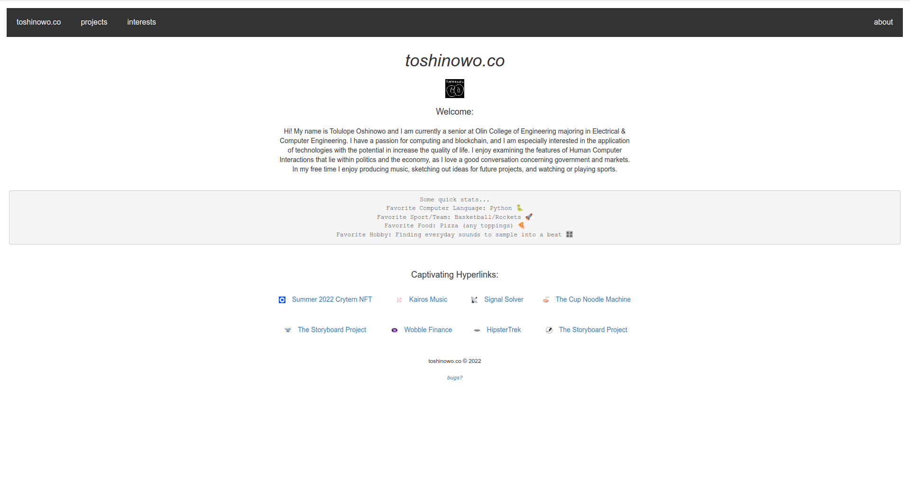

# toshinowo.co 

### Summary

Welcome to the GitHub repo for toshinowo.co!  
I undertook this project as a way to put my ruby, rails, and web development skills to the test, creating personal website that I developed using Ruby and Rails 7.0. This website now serves as a supplement to my LinkedIn profile and as a channel for me to express myself through projects and interests, among other quirky happenings.

### Screenshot

Here is a screenshot of toshinowo.co:  

